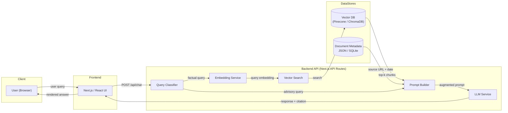
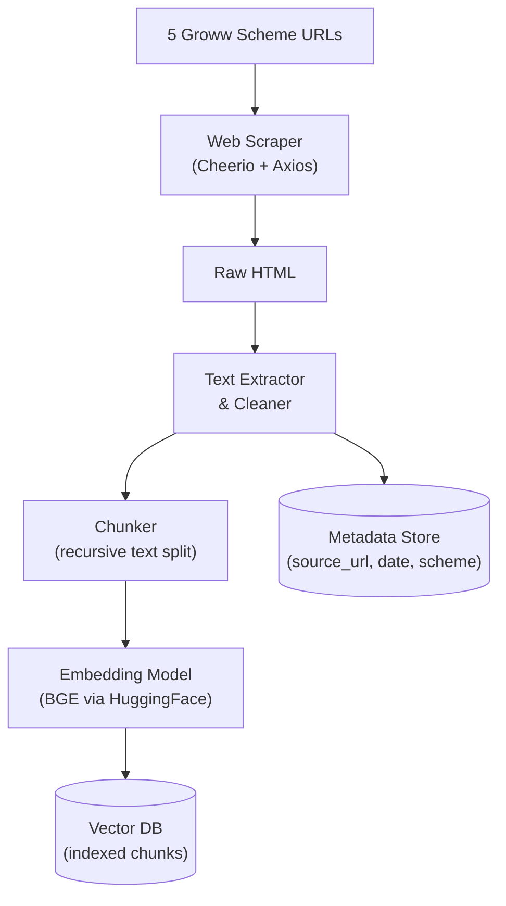
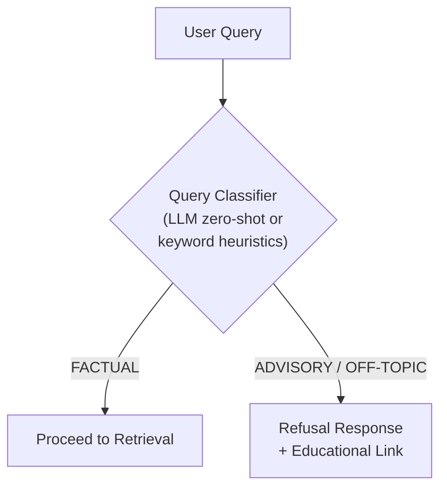
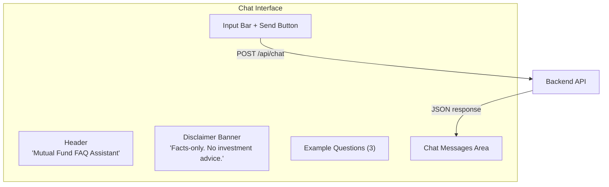
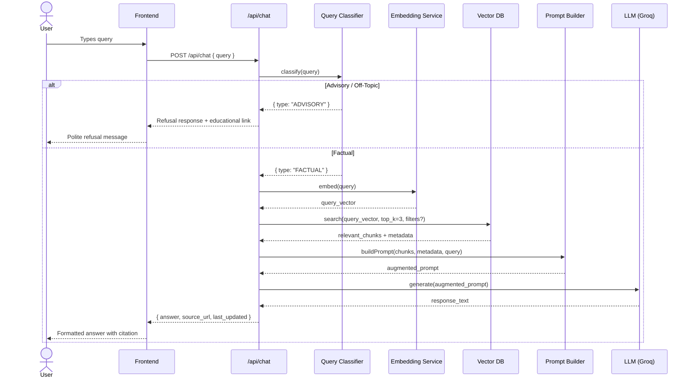
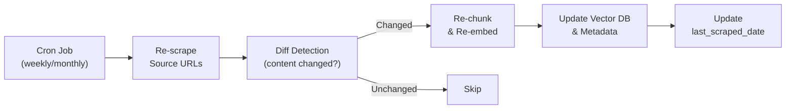

# Architecture: Mutual Fund FAQ Assistant (RAG Chatbot)

> **Reference:** [problemStatement.md](file:///c:/Users/rparv/.antigravity-ide/RAG%20chatbot/docs/problemStatement.md)
> **AMC:** HDFC Mutual Fund · **Schemes:** 5 (Large-Cap, Mid-Cap, Small-Cap, Gold ETF FoF, Silver ETF FoF)

---

## 1. High-Level System Overview

The system follows a **Retrieval-Augmented Generation (RAG)** architecture, where user queries are answered by first retrieving relevant chunks from a pre-indexed corpus scraped from the **5 Groww scheme pages**, and then generating a concise, source-backed response via an LLM.



### Key Principles

| Principle | Description |
|-----------|-------------|
| **Facts-Only** | No investment advice, opinions, or return comparisons — ever. |
| **Source-Backed** | Every answer carries exactly one citation link + last-updated date. |
| **Privacy-First** | Zero collection of PII (PAN, Aadhaar, phone, email, OTP). |
| **Minimal & Transparent** | ≤ 3 sentences per response; clear refusal for out-of-scope queries. |

---

## 2. Component Architecture

### 2.1 Data Ingestion Pipeline

Responsible for scraping, cleaning, chunking, embedding, and indexing the **5 Groww scheme pages** into the vector store. No PDFs or external AMC/AMFI/SEBI sources are used.



#### Source URLs (Exhaustive List)

| # | Scheme | Groww URL |
|---|--------|-----------|
| 1 | HDFC Large Cap Fund – Direct Plan Growth | https://groww.in/mutual-funds/hdfc-large-cap-fund-direct-growth |
| 2 | HDFC Mid-Cap Fund – Direct Plan Growth | https://groww.in/mutual-funds/hdfc-mid-cap-fund-direct-growth |
| 3 | HDFC Small Cap Fund – Direct Plan Growth | https://groww.in/mutual-funds/hdfc-small-cap-fund-direct-growth |
| 4 | HDFC Gold ETF Fund of Fund – Direct Plan Growth | https://groww.in/mutual-funds/hdfc-gold-etf-fund-of-fund-direct-plan-growth |
| 5 | HDFC Silver ETF FoF – Direct Plan Growth | https://groww.in/mutual-funds/hdfc-silver-etf-fof-direct-growth |

**Total sources:** 5 Groww URLs (HTML only — no PDFs, no external documents).

#### Chunking Strategy

> **Updated post-Phase 2A** — The scraped data has clear `--- Section ---`
> delimiters creating semantically distinct blocks. A section-aware strategy
> is used instead of naive recursive splitting.

| Parameter | Value | Rationale |
|-----------|-------|-----------|
| Primary splitter | Section-aware (`--- ... ---` delimiter) | Preserves semantic coherence of fund details, returns, holdings, etc. |
| Fallback splitter | `RecursiveCharacterTextSplitter` (600 tokens, 100 overlap) | Only for oversized sections (e.g., Holdings with 47–85 stocks) |
| Min chunk size | 150 tokens | Small sections are merged to avoid poor embeddings |
| Max chunk size | 800 tokens | Oversized sections are split at row boundaries (`\n`) |
| Scheme prefix | Prepended to every chunk | Ensures embedding captures the scheme context |
| Deduplication | Remove concatenated noise, duplicate fragments | Scraper produces some redundant text from heading extraction |
| Metadata per chunk | `chunk_id`, `scheme_name`, `source_url`, `section`, `last_scraped` | Enables citation, filtering, and traceability |
| Expected output | ~5–8 chunks/scheme, ~25–40 total | Small corpus — quality over quantity |

---

### 2.2 Query Classifier

Before retrieval, every incoming query passes through a lightweight classifier that determines whether the query is **factual** (proceed to RAG) or **advisory** (refuse politely).



#### Classification Logic

| Category | Examples | Action |
|----------|----------|--------|
| **Factual** | "What is the expense ratio of HDFC Large Cap Fund?" | → Retrieve + Generate |
| **Advisory** | "Should I invest in HDFC Small Cap Fund?" | → Polite refusal + AMFI/SEBI link |
| **Comparative** | "Which is better — HDFC Mid-Cap or Small Cap?" | → Polite refusal + factsheet links |
| **Off-Topic** | "What is the weather today?" | → Polite refusal (out of scope) |

**Implementation approach:** Two-tier classification:

1. **Keyword / Regex Layer** — fast, catches obvious advisory patterns (`"should I"`, `"better than"`, `"recommend"`, `"which fund"`)
2. **LLM Fallback** — for ambiguous queries, use a small system-prompt-based classification call

---

### 2.3 Retrieval Module

Performs semantic search over the indexed corpus to find the most relevant document chunks.

> **Corpus:** 23 chunks across 5 schemes (avg 308 tokens, max 622 tokens)

| Parameter | Value |
|-----------|-------|
| Embedding model | `BAAI/bge-small-en-v1.5` via `@xenova/transformers` (local inference) |
| Embedding dimensions | 384 |
| Model size | ~130 MB (suitable for serverless deployment) |
| Vector DB | **Local JSON File** (`data/processed/vector_store.json`) |
| Similarity metric | Pure JavaScript Cosine Similarity |
| Top-k results | 3 chunks (sufficient for 23-chunk corpus) |
| Pre-filter | Filter by `scheme_name` if scheme is detected in query |
| Query prefix | `"Represent this sentence for searching relevant passages: "` (required by BGE) |
| Document prefix | `"Represent this sentence: "` (applied during indexing) |

#### Retrieval Flow

```
1. Apply BGE query prefix → "Represent this sentence for searching relevant passages: {query}"
2. Embed prefixed query → query_vector (384-dim)
3. (Optional) Extract scheme name from query → apply metadata filter
4. Load vector_store.json into memory
5. Compute cosine similarity between query_vector and all chunks
6. Sort by similarity score descending
7. Filter chunks below similarity threshold (e.g., < 0.7)
8. Pass top-k chunks + metadata to Prompt Builder
```

---

### 2.4 Prompt Builder & LLM Service

Constructs the augmented prompt and sends it to the LLM for response generation.

#### System Prompt (Core)

```text
You are a facts-only FAQ assistant for HDFC Mutual Fund schemes on Groww.
Your rules:
1. Answer ONLY factual, verifiable questions about mutual fund schemes.
2. Use ONLY the provided context to answer. Do NOT fabricate information.
3. Keep your answer to a MAXIMUM of 3 sentences.
4. Include EXACTLY ONE source citation link in your answer.
5. End every answer with: "Last updated from sources: <date>"
6. REFUSE any question asking for investment advice, recommendations, 
   performance comparisons, or return predictions. Respond politely, 
   explain your limitation, and provide a link to AMFI or SEBI resources.
7. NEVER ask for or acknowledge PII (PAN, Aadhaar, phone, email, OTP).
```

#### Prompt Template

```text
SYSTEM: {system_prompt}

CONTEXT:
---
{retrieved_chunk_1}
Source: {source_url_1} | Last Scraped: {date_1}
---
{retrieved_chunk_2}
Source: {source_url_2} | Last Scraped: {date_2}
---
{retrieved_chunk_3}
Source: {source_url_3} | Last Scraped: {date_3}
---

USER QUERY: {user_query}

ASSISTANT:
```

#### LLM Configuration

| Parameter | Value |
|-----------|-------|
| Model | `llama-3.1-8b-instant` (Groq) |
| Temperature | `0.1` (low creativity, high factual accuracy) |
| Max tokens | `300` |
| Top-p | `0.9` |
| Stop sequences | None |

---

### 2.5 Frontend (Minimal Chat UI)

A clean, minimal single-page chat interface.



#### UI Components

| Component | Description |
|-----------|-------------|
| **Header** | App title + HDFC AMC branding context |
| **Disclaimer Banner** | Persistent banner: *"Facts-only. No investment advice."* |
| **Example Questions** | 3 clickable starter queries (e.g., "What is the expense ratio of HDFC Large Cap Fund?") |
| **Chat Area** | Scrollable message thread with user/bot message bubbles |
| **Citation Footer** | Each bot message shows source link + last-updated date |
| **Input Bar** | Text input + send button; no file upload or PII fields |

---

## 3. Data Flow — End-to-End



---

## 4. Tech Stack

| Layer | Technology | Rationale |
|-------|------------|-----------|
| **Frontend** | Next.js (React) | SSR, API routes, fast iteration |
| **Styling** | Vanilla CSS | Full control, no framework overhead |
| **Backend API** | Next.js API Routes | Co-located with frontend, serverless-ready |
| **LLM Provider** | Groq (`llama-3.1-8b-instant`) | Free tier, fast inference, low latency |
| **Embedding Model** | `BAAI/bge-small-en-v1.5` (HuggingFace Transformers) | Open-source, free, high-quality 384-dim embeddings |
| **Vector Database** | ChromaDB (dev) / Pinecone (prod) | ChromaDB for local dev; Pinecone for scalable prod |
| **Web Scraping** | Cheerio + Axios (HTML only) | Lightweight, no browser needed for static Groww pages |
| **Chunking** | LangChain `RecursiveCharacterTextSplitter` | Smart boundary-aware splitting |
| **Metadata Store** | JSON file or SQLite | Simple, sufficient for 5 source URLs |
| **Deployment** | Vercel | Native Next.js support, edge functions |

---

## 5. API Contract

### `POST /api/chat`

#### Request

```json
{
  "query": "What is the exit load for HDFC Mid-Cap Fund?",
  "session_id": "optional-uuid"
}
```

#### Response — Factual Answer

```json
{
  "type": "FACTUAL",
  "answer": "The exit load for HDFC Mid-Cap Fund is 1% if redeemed within 1 year from the date of allotment. No exit load is charged after 1 year.",
  "source_url": "https://groww.in/mutual-funds/hdfc-mid-cap-fund-direct-growth",
  "last_updated": "2026-06-28",
  "scheme": "HDFC Mid-Cap Fund – Direct Plan Growth"
}
```

#### Response — Refusal

```json
{
  "type": "ADVISORY_REFUSAL",
  "answer": "I'm a facts-only assistant and cannot provide investment advice or fund recommendations. For investment guidance, please consult a SEBI-registered advisor.",
  "educational_link": "https://www.amfiindia.com/investor-corner/knowledge-center.html",
  "last_updated": "2026-06-28"
}
```

---

## 6. Project Folder Structure

```
RAG chatbot/
├── docs/
│   ├── problemStatement.md          # Project requirements & scope
│   ├── problemstatement.txt         # Original problem statement
│   └── Architecture.md              # This document
├── data/
│   ├── raw/                         # Raw scraped HTML from Groww pages
│   ├── processed/                   # Cleaned text files
│   └── metadata.json               # Source URL + date mapping (5 entries)
├── scripts/
│   ├── scrape.js                    # Web scraper for source URLs
│   ├── chunk.js                     # Text chunking logic
│   ├── embed.js                     # Embedding generation
│   └── index.js                     # Vector DB indexing
├── src/
│   ├── app/
│   │   ├── page.jsx                 # Chat UI (main page)
│   │   ├── layout.jsx               # Root layout
│   │   ├── globals.css              # Global styles
│   │   └── api/
│   │       └── chat/
│   │           └── route.js         # Chat API endpoint
│   ├── lib/
│   │   ├── classifier.js            # Query classification logic
│   │   ├── embeddings.js            # Embedding helper
│   │   ├── vectorStore.js           # Vector DB client
│   │   ├── promptBuilder.js         # Prompt template construction
│   │   └── llm.js                   # LLM client (Groq)
│   └── components/
│       ├── ChatWindow.jsx           # Chat message display
│       ├── MessageBubble.jsx        # Individual message component
│       ├── InputBar.jsx             # Query input + send button
│       ├── DisclaimerBanner.jsx     # Facts-only disclaimer
│       └── ExampleQuestions.jsx     # Starter question chips
├── .env.local                       # API keys (GROQ_API_KEY, etc.)
├── package.json
├── next.config.js
└── README.md
```

---

## 7. Security & Compliance Guardrails

### 7.1 PII Protection

| Guardrail | Implementation |
|-----------|----------------|
| **Input sanitization** | Strip/detect PII patterns (PAN: `[A-Z]{5}[0-9]{4}[A-Z]`, Aadhaar: `\d{4}\s?\d{4}\s?\d{4}`, phone: `\d{10}`) before processing |
| **No PII storage** | No database fields for personal data; session is ephemeral |
| **System prompt enforcement** | LLM instructed to never ask for or acknowledge PII |

### 7.2 Content Safety

| Guardrail | Implementation |
|-----------|----------------|
| **Advisory detection** | Two-tier classifier blocks investment advice queries |
| **Hallucination prevention** | LLM constrained to answer only from retrieved context |
| **Source verification** | Only Groww scheme URLs (from the 5 source pages) allowed as citations |
| **Response length cap** | Max 3 sentences enforced via prompt + post-processing |

### 7.3 Source Integrity

| Guardrail | Implementation |
|-----------|----------------|
| **URL allowlist** | Only the 5 `groww.in/mutual-funds/...` scheme URLs are permitted as sources |
| **Last-updated tracking** | Every chunk stores scrape date; displayed in responses |
| **Periodic re-scraping** | Scheduled re-ingestion of the 5 Groww pages to keep data current (configurable interval) |

---

## 8. Data Refresh Strategy



| Parameter | Value |
|-----------|-------|
| Refresh frequency | Daily via GitHub Actions Cron (`.github/workflows/ingest.yml`) |
| Diff detection | Compare content hash of new scrape vs. stored hash |
| Stale threshold | Flag data older than 30 days in responses |

---

## 9. Error Handling

| Scenario | Behavior |
|----------|----------|
| **No relevant chunks found** (low similarity scores) | "I couldn't find relevant information for your query in my sources. Please try rephrasing or visit [Groww Mutual Funds](https://groww.in/mutual-funds) directly." |
| **LLM API failure** | Retry once with exponential backoff; if still failing, return a graceful error message |
| **Vector DB unavailable** | Return cached response if available, otherwise show maintenance message |
| **Embedding API failure** | Queue the query and retry; notify user of temporary delay |
| **Invalid / empty query** | "Please enter a valid question about HDFC mutual fund schemes." |

---

## 10. Performance Targets

| Metric | Target |
|--------|--------|
| **Response latency (p95)** | < 3 seconds end-to-end |
| **Retrieval accuracy** | > 85% relevant chunks in top-3 |
| **Factual accuracy** | > 95% (validated against source documents) |
| **Refusal precision** | > 90% advisory queries correctly refused |
| **Uptime** | 99.5% (Vercel SLA) |

---

## 11. Future Enhancements (Out of Scope for v1)

| Enhancement | Description |
|-------------|-------------|
| **Multi-AMC support** | Expand corpus to cover SBI, ICICI, Axis, etc. |
| **Conversation memory** | Enable multi-turn follow-up questions |
| **Voice interface** | Speech-to-text input for accessibility |
| **Admin dashboard** | Monitor query patterns, refusal rates, and source freshness |
| **Feedback loop** | Thumbs up/down on responses to improve retrieval quality |
| **Multilingual support** | Hindi and regional language responses |

---

## 12. Glossary

| Term | Definition |
|------|------------|
| **AMC** | Asset Management Company — entity managing mutual fund schemes |
| **AMFI** | Association of Mutual Funds in India — industry body |
| **SEBI** | Securities and Exchange Board of India — market regulator |
| **RAG** | Retrieval-Augmented Generation — pattern combining search with LLM generation |
| **KIM** | Key Information Memorandum — summary disclosure document |
| **SID** | Scheme Information Document — detailed scheme document |
| **ELSS** | Equity Linked Savings Scheme — tax-saving mutual fund category |
| **SIP** | Systematic Investment Plan — periodic investment method |
| **FoF** | Fund of Fund — a fund that invests in other funds/ETFs |
| **NAV** | Net Asset Value — per-unit price of a mutual fund |
