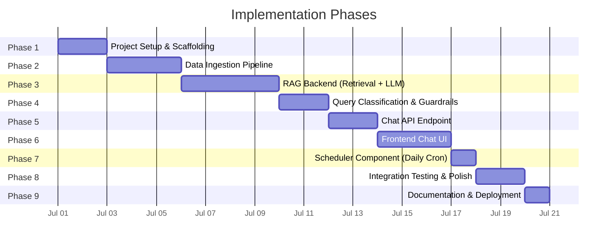
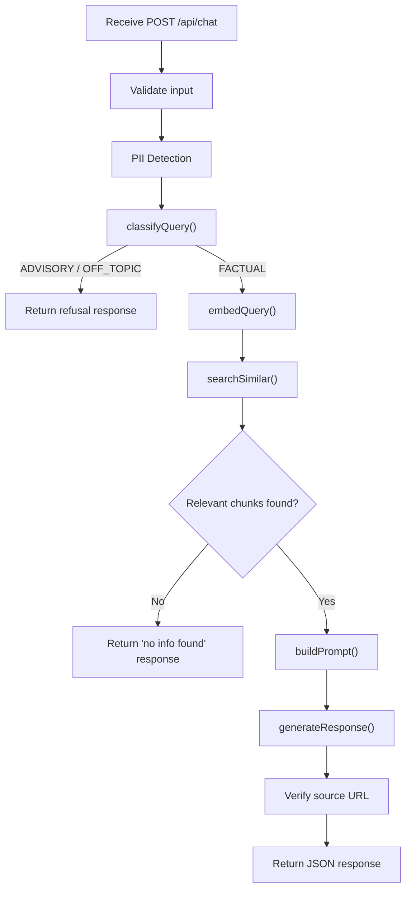
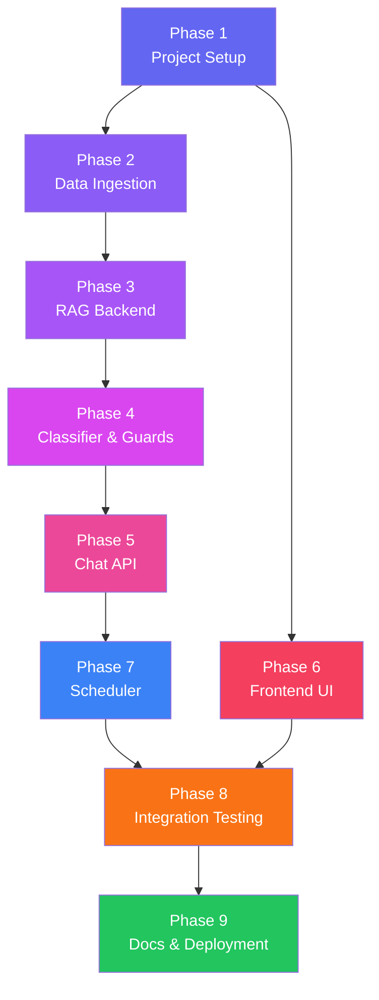

# Implementation Plan: Mutual Fund FAQ Assistant (RAG Chatbot)

> **Reference:** [Architecture.md](file:///c:/Users/rparv/.antigravity-ide/RAG%20chatbot/docs/Architecture.md) · [problemStatement.md](file:///c:/Users/rparv/.antigravity-ide/RAG%20chatbot/docs/problemStatement.md)

---

## Phase Overview



| Phase | Name | Key Deliverables | Est. Duration |
|-------|------|------------------|---------------|
| 1 | Project Setup & Scaffolding | Next.js app, folder structure, env config | 1–2 days |
| 2 | Data Ingestion Pipeline | Scraper, chunker, embeddings, vector DB index | 2–3 days |
| 3 | RAG Backend | Retrieval module, prompt builder, LLM service | 3–4 days |
| 4 | Query Classification & Guardrails | Classifier, PII detection, refusal handler | 1–2 days |
| 5 | Chat API Endpoint | `POST /api/chat` wiring all modules together | 1–2 days |
| 6 | Frontend Chat UI | Chat interface, disclaimer, example questions | 2–3 days |
| 7 | Scheduler Component | Cron job route to trigger daily ingestion | 1 day |
| 8 | Integration Testing & Polish | End-to-end testing, edge cases, UX refinement | 1–2 days |
| 9 | Documentation & Deployment | README, deployment to Vercel | 1 day |

---

## Phase 1: Project Setup & Scaffolding

### Objective

Bootstrap the Next.js project, establish the folder structure from [Architecture §6](file:///c:/Users/rparv/.antigravity-ide/RAG%20chatbot/docs/Architecture.md), and configure environment variables.

### Tasks

- [ ] **1.1** Initialize Next.js app using `npx -y create-next-app@latest ./` (App Router, JavaScript, no Tailwind)
- [ ] **1.2** Create the folder structure:
  ```
  RAG chatbot/
  ├── data/
  │   ├── raw/
  │   ├── processed/
  │   └── metadata.json
  ├── scripts/
  │   ├── scrape.js
  │   ├── chunk.js
  │   ├── embed.js
  │   └── index.js
  ├── src/
  │   ├── app/
  │   │   └── api/chat/route.js
  │   ├── lib/
  │   │   ├── classifier.js
  │   │   ├── embeddings.js
  │   │   ├── vectorStore.js
  │   │   ├── promptBuilder.js
  │   │   └── llm.js
  │   └── components/
  │       ├── ChatWindow.jsx
  │       ├── MessageBubble.jsx
  │       ├── InputBar.jsx
  │       ├── DisclaimerBanner.jsx
  │       └── ExampleQuestions.jsx
  └── docs/
  ```
- [ ] **1.3** Create `.env.local` with placeholder keys:
  ```env
  GROQ_API_KEY=
  PINECONE_API_KEY=        # or ChromaDB config
  PINECONE_INDEX_NAME=
  ```
- [ ] **1.4** Install core dependencies:
  ```bash
  npm install axios cheerio langchain @langchain/community
  npm install @xenova/transformers   # for BGE embeddings (local inference)
  npm install chromadb               # or @pinecone-database/pinecone
  npm install groq-sdk
  ```
- [ ] **1.5** Verify `npm run dev` starts successfully with the default Next.js page

### Exit Criteria

✅ Project scaffolded and running locally  
✅ All directories created  
✅ `.env.local` in place with placeholder keys  
✅ All dependencies installed without errors

---

## Phase 2: Data Ingestion Pipeline

### Objective

Scrape the 5 Groww scheme pages, clean the HTML, chunk the text, generate embeddings, and index them into the vector database.

### Architecture Reference

→ [§2.1 Data Ingestion Pipeline](file:///c:/Users/rparv/.antigravity-ide/RAG%20chatbot/docs/Architecture.md)

### Tasks

#### 2A. Web Scraper (`scripts/scrape.js`)

- [ ] **2.1** Define the 5 source URLs in a config array:
  ```js
  const SOURCES = [
    { scheme: "HDFC Large Cap Fund", url: "https://groww.in/mutual-funds/hdfc-large-cap-fund-direct-growth" },
    { scheme: "HDFC Mid-Cap Fund", url: "https://groww.in/mutual-funds/hdfc-mid-cap-fund-direct-growth" },
    { scheme: "HDFC Small Cap Fund", url: "https://groww.in/mutual-funds/hdfc-small-cap-fund-direct-growth" },
    { scheme: "HDFC Gold ETF FoF", url: "https://groww.in/mutual-funds/hdfc-gold-etf-fund-of-fund-direct-plan-growth" },
    { scheme: "HDFC Silver ETF FoF", url: "https://groww.in/mutual-funds/hdfc-silver-etf-fof-direct-growth" },
  ];
  ```
- [ ] **2.2** Use `axios` to fetch each URL's HTML content
- [ ] **2.3** Use `cheerio` to parse HTML and extract meaningful text (strip nav, footer, ads, scripts)
- [ ] **2.4** Save raw HTML to `data/raw/{scheme-slug}.html`
- [ ] **2.5** Save cleaned text to `data/processed/{scheme-slug}.txt`
- [ ] **2.6** Generate `data/metadata.json` with entries:
  ```json
  [
    {
      "scheme_name": "HDFC Large Cap Fund",
      "source_url": "https://groww.in/mutual-funds/hdfc-large-cap-fund-direct-growth",
      "last_scraped": "2026-07-02T12:00:00Z",
      "content_hash": "sha256:..."
    }
  ]
  ```
- [ ] **2.7** Run scraper and verify all 5 pages produce clean output

#### 2B. Text Chunker (`scripts/chunk.js`)

> **Updated based on actual parsed data analysis (Phase 2A output)**
>
> The scraped data has a clear `--- Section Name ---` delimited structure with
> semantically distinct sections (Fund Details, Return Calculator, Holdings,
> Peer Comparison, Fund Management, etc.). A **section-aware chunking strategy**
> is used instead of naive recursive splitting.

- [ ] **2.8** Implement **two-pass section-aware chunking**:

  **Pass 1 — Clean & Deduplicate:**
  - Strip the metadata header (Source/Scheme/Scraped lines) — stored separately as chunk metadata
  - Remove known noisy patterns:
    - Concatenated text lines (e.g., `"Monthly SIPOne timeMonthly investment₹5,000..."`)
    - Duplicate heading fragments (e.g., `"CSChirag SetalvadJan 2013 - PresentView details"`)
    - Lines that are substrings of earlier, richer lines
  - Normalize whitespace and remove empty lines

  **Pass 2 — Section-aware splitting:**
  - Split on `--- Section Name ---` delimiters → one chunk per section
  - Prepend the scheme name + category to **every chunk** for context (e.g., `"HDFC Large Cap Fund (Equity | Large Cap | Very High Risk)"`)
  - For **oversized sections** (> 800 tokens, e.g., Holdings with 47–85 stocks):
    - Use `RecursiveCharacterTextSplitter` with chunk size **600 tokens**, overlap **100 tokens**
    - Split boundary: prefer `\n` (row boundary) to avoid cutting mid-holding
  - For **small adjacent sections** (< 150 tokens each):
    - Merge into a single chunk to avoid too-small embeddings (e.g., merge "Minimum investments" + "Understand terms")

  **Expected section→chunk mapping per scheme:**

  | Section | Approx Size | Chunking Action |
  |---------|-------------|-----------------|
  | Scheme header + Category | ~50 tokens | Merge with Fund Details |
  | Fund Details (NAV, SIP, AUM, Expense, Rating) | ~80 tokens | Merge with header → **1 chunk** |
  | Return Calculator (SIP table) | ~120 tokens | **1 chunk** (keep table intact) |
  | Portfolio Holdings (top 19–85 stocks) | 200–1500 tokens | **1–3 chunks** (split by rows if oversized) |
  | Minimum Investments | ~40 tokens | Merge with other small sections |
  | Understand Terms | ~60 tokens | Merge with Minimum Investments → **1 chunk** |
  | Compare Similar Funds (peer table) | ~150 tokens | **1 chunk** |
  | Fund Management (manager bios) | ~200 tokens | **1 chunk** |
  | Performance vs Category (rank table) | ~80 tokens | Merge with peer comparison → **1 chunk** |
  | Additional Data (remaining holdings) | 200–800 tokens | **1–2 chunks** |

  **Expected total:** ~5–8 chunks per scheme, ~25–40 chunks total across all 5 schemes.

- [ ] **2.9** Attach metadata to each chunk:
  ```json
  {
    "chunk_id": "hdfc-large-cap-fund__fund-details",
    "scheme_name": "HDFC Large Cap Fund",
    "source_url": "https://groww.in/mutual-funds/hdfc-large-cap-fund-direct-growth",
    "section": "Fund Details",
    "last_scraped": "2026-06-30T19:30:11.399Z"
  }
  ```
- [ ] **2.10** Save chunks to `data/processed/chunks.json` for inspection
- [ ] **2.11** Verify chunk count and quality:
  - Spot-check 5–10 chunks manually
  - Verify no chunk contains concatenated noise
  - Verify every chunk contains the scheme name prefix
  - Verify no table row is split across chunks

#### 2C. Embedding & Indexing (`scripts/embed.js` + `scripts/index.js`)

> **Updated based on actual chunk analysis (Phase 2B output)**
>
> The corpus is **23 chunks** (avg 308 tokens, max 622 tokens). Given the small
> corpus size and structured content (tables, key-value pairs), `bge-small-en-v1.5`
> provides sufficient discriminative power while keeping model size minimal (~130 MB).

##### Model Selection: `BAAI/bge-small-en-v1.5`

  | Factor | Analysis | Decision |
  |--------|----------|----------|
  | Corpus size | 23 chunks — trivially small | Small model is sufficient |
  | Content type | Structured tables/KV pairs, not nuanced prose | No need for high-capacity model |
  | Max chunk tokens | 622 (estimated) — fits within 512 BERT token limit for most chunks | Acceptable; largest chunks may lose ~10% tail |
  | Deployment target | Vercel serverless (limited memory) | 130 MB ≫ 1.3 GB (bge-large) |
  | MTEB accuracy | 62.17 vs 64.23 (bge-large) — +2 pts marginal | Not worth 10× memory for 23 items |

  **Verdict:** `bge-small-en-v1.5` (384 dimensions, ~130 MB) ✅

##### Instruction Prefixes (Required by BGE)

  BGE models perform significantly better when using instruction prefixes:
  ```js
  // For document chunks (during indexing):
  const docInput = `Represent this sentence: ${chunkText}`;

  // For user queries (during retrieval):
  const queryInput = `Represent this sentence for searching relevant passages: ${queryText}`;
  ```

- [ ] **2.12** Generate embeddings for all 23 chunks in `scripts/embed.js`:
  - Use `@xenova/transformers` pipeline with `BAAI/bge-small-en-v1.5`
  - Apply `Represent this sentence:` prefix to each chunk's text
  - Batch process all chunks (small enough for single pass)

- [ ] **2.13** Save embeddings to local JSON vector store:
  - Save to `data/processed/vector_store.json`
  - Structure: `{ chunks: [{ chunk_id, text, metadata, embedding }] }`
  - *Note: ChromaDB was dropped in favor of a serverless JSON file since the JS client requires a running server and 23 chunks can easily be searched in-memory.*

- [ ] **2.14** Implement test similarity search (`scripts/search.js`):
  - Load `vector_store.json`
  - Calculate cosine similarity using pure JavaScript
  - Verify indexing with test similarity searches:

  | # | Test Query | Expected Top Result (scheme + section) |
  |---|------------|----------------------------------------|
  | 1 | `"expense ratio HDFC Large Cap"` | HDFC Large Cap → Overview + Fund Details |
  | 2 | `"top holdings HDFC Mid Cap Fund"` | HDFC Mid-Cap → Portfolio Holdings |
  | 3 | `"minimum SIP amount for gold fund"` | HDFC Gold ETF FoF → Overview + Fund Details |
  | 4 | `"who manages HDFC Small Cap Fund"` | HDFC Small Cap → Fund management |
  | 5 | `"3 year return HDFC Silver ETF"` | HDFC Silver ETF → Overview or Additional Data |

### Exit Criteria

✅ All 5 pages scraped and stored in `data/raw/`  
✅ Clean text extracted into `data/processed/`  
✅ `metadata.json` populated with 5 entries  
✅ 23 chunks generated with correct metadata and scheme prefixes  
✅ Embeddings (384-dim) generated for all chunks using BGE-small  
✅ Saved to local `vector_store.json`  
✅ All 5 test queries return the expected top result

---

## Phase 3: RAG Backend (Retrieval + LLM)

### Objective

Build the core RAG pipeline: embed user queries, retrieve relevant chunks, construct augmented prompts, and generate LLM responses.

### Architecture Reference

→ [§2.3 Retrieval Module](file:///c:/Users/rparv/.antigravity-ide/RAG%20chatbot/docs/Architecture.md) · [§2.4 Prompt Builder & LLM](file:///c:/Users/rparv/.antigravity-ide/RAG%20chatbot/docs/Architecture.md)

### Tasks

#### 3A. Embedding Helper (`src/lib/embeddings.js`)

- [ ] **3.1** Create `embedQuery(text)` function → returns embedding vector
- [ ] **3.2** Use BGE `BAAI/bge-small-en-v1.5` model via `@xenova/transformers` (local inference, no API key needed)
- [ ] **3.3** Handle API errors with retry + graceful fallback

#### 3B. Vector Store Client (`src/lib/vectorStore.js`)

> **Updated post-Phase 2C**: Using local `vector_store.json` instead of ChromaDB.

- [ ] **3.4** Create `searchSimilar(queryVector, topK, filters)` function
- [ ] **3.5** Load `vector_store.json` into memory and implement pure JS cosine similarity search with `top-k = 3`
- [ ] **3.6** Support optional metadata filter by `scheme_name`
- [ ] **3.7** Apply similarity threshold filter (discard chunks with score < 0.7)
- [ ] **3.8** Return chunks with metadata: `{ text, source_url, scheme_name, last_scraped, score }`

#### 3C. Prompt Builder (`src/lib/promptBuilder.js`)

- [ ] **3.9** Define the system prompt (from Architecture §2.4):
  ```
  You are a facts-only FAQ assistant for HDFC Mutual Fund schemes on Groww.
  Rules: facts-only, max 3 sentences, 1 citation, refuse advisory, no PII...
  ```
- [ ] **3.10** Implement `buildPrompt(chunks, userQuery)` → returns formatted prompt string
- [ ] **3.11** Template injects retrieved chunks with their `source_url` and `last_scraped_date`
- [ ] **3.12** Include explicit instructions to select the best single source URL for the citation

#### 3D. LLM Service (`src/lib/llm.js`)

- [ ] **3.13** Create `generateResponse(prompt)` function using Groq SDK
- [ ] **3.14** Configure LLM parameters for `llama-3.3-70b-versatile`:
  | Parameter | Value |
  |-----------|-------|
  | Model | `llama-3.3-70b-versatile` |
  | Temperature | `0.1` |
  | Max tokens | `300` |
  | Top-p | `0.9` |
- [ ] **3.15** Parse LLM response to extract: `answer`, `source_url`, `last_updated`
- [ ] **3.16** Handle strict Groq API rate limits (30 RPM, 12K TPM):
  - Implement a `rate_limit_retry` wrapper with exponential backoff
  - Catch `429 Too Many Requests` errors
  - Wait `(retry_count * 2)` seconds before retrying (max 3 retries)
- [ ] **3.17** Test full pipeline manually:
  ```
  Input: "What is the minimum SIP amount for HDFC Small Cap Fund?"
  Expected: ≤ 3 sentence answer + Groww source link + last-updated date
  ```

### Exit Criteria

✅ `embedQuery()` returns valid 384-dim vector  
✅ `searchSimilar()` returns top-3 relevant chunks  
✅ `buildPrompt()` produces correctly formatted augmented prompt  
✅ `generateResponse()` returns factual, source-backed answer  
✅ Full pipeline tested end-to-end via manual function calls

---

## Phase 4: Query Classification & Guardrails

### Objective

Implement the two-tier query classifier and safety guardrails (PII detection, advisory refusal, source verification).

### Architecture Reference

→ [§2.2 Query Classifier](file:///c:/Users/rparv/.antigravity-ide/RAG%20chatbot/docs/Architecture.md) · [§7 Security & Compliance](file:///c:/Users/rparv/.antigravity-ide/RAG%20chatbot/docs/Architecture.md)

### Tasks

#### 4A. Query Classifier (`src/lib/classifier.js`)

- [ ] **4.1** Implement **Tier 1 — Keyword/Regex classifier**:
  ```js
  const ADVISORY_PATTERNS = [
    /should\s+i\s+(invest|buy|sell)/i,
    /which\s+(fund|scheme)\s+is\s+better/i,
    /recommend/i,
    /compare.*return/i,
    /will.*go\s+up/i,
    /predict/i,
  ];
  ```
- [ ] **4.2** Implement **Tier 2 — LLM fallback** for ambiguous queries:
  - Send a lightweight classification prompt to Groq
  - Classify as `FACTUAL`, `ADVISORY`, or `OFF_TOPIC`
- [ ] **4.3** Export `classifyQuery(query)` → returns `{ type, confidence }`
- [ ] **4.4** Define refusal response templates:
  ```js
  const REFUSAL_TEMPLATES = {
    ADVISORY: "I'm a facts-only assistant and cannot provide investment advice...",
    COMPARATIVE: "I cannot compare fund performance. You can view individual factsheets at...",
    OFF_TOPIC: "I can only answer factual questions about HDFC Mutual Fund schemes on Groww...",
  };
  ```

#### 4B. PII Detection Guard

- [ ] **4.5** Create PII regex patterns:
  | PII Type | Pattern |
  |----------|---------|
  | PAN | `[A-Z]{5}[0-9]{4}[A-Z]` |
  | Aadhaar | `\d{4}\s?\d{4}\s?\d{4}` |
  | Phone | `\d{10}` or `\+91\d{10}` |
  | Email | Standard email regex |
- [ ] **4.6** Strip detected PII from query before processing
- [ ] **4.7** If PII detected, append a warning: *"Please do not share personal information."*

#### 4C. Source Verification Guard

- [ ] **4.8** Define URL allowlist:
  ```js
  const ALLOWED_SOURCES = [
    "https://groww.in/mutual-funds/hdfc-large-cap-fund-direct-growth",
    "https://groww.in/mutual-funds/hdfc-mid-cap-fund-direct-growth",
    "https://groww.in/mutual-funds/hdfc-small-cap-fund-direct-growth",
    "https://groww.in/mutual-funds/hdfc-gold-etf-fund-of-fund-direct-plan-growth",
    "https://groww.in/mutual-funds/hdfc-silver-etf-fof-direct-growth",
  ];
  ```
- [ ] **4.9** Validate that LLM-generated citation URL is in the allowlist; replace if not

### Test Cases

| # | Input | Expected Classification | Expected Response |
|---|-------|------------------------|-------------------|
| 1 | "What is the expense ratio of HDFC Large Cap?" | `FACTUAL` | Proceed to RAG |
| 2 | "Should I invest in HDFC Small Cap?" | `ADVISORY` | Polite refusal |
| 3 | "Which is better, HDFC Mid-Cap or Small Cap?" | `ADVISORY` | Polite refusal |
| 4 | "What's the weather today?" | `OFF_TOPIC` | Out-of-scope refusal |
| 5 | "My PAN is ABCDE1234F, show my portfolio" | `PII_DETECTED` | Warning + strip PII |

### Exit Criteria

✅ Keyword classifier catches > 80% of advisory queries  
✅ LLM fallback handles ambiguous edge cases  
✅ PII detection strips sensitive data before processing  
✅ All 5 test cases pass  
✅ Refusal messages are polite and include educational links

---

## Phase 5: Chat API Endpoint

### Objective

Wire all backend modules into a single `POST /api/chat` endpoint that handles the complete request lifecycle.

### Architecture Reference

→ [§5 API Contract](file:///c:/Users/rparv/.antigravity-ide/RAG%20chatbot/docs/Architecture.md) · [§3 Data Flow](file:///c:/Users/rparv/.antigravity-ide/RAG%20chatbot/docs/Architecture.md)

### Tasks

- [ ] **5.1** Create `src/app/api/chat/route.js` with `POST` handler
- [ ] **5.2** Implement the request flow:



- [ ] **5.3** Implement request validation:
  - Reject empty or whitespace-only queries
  - Cap query length at 500 characters
- [ ] **5.4** Implement response formatting per API contract:
  ```json
  {
    "type": "FACTUAL" | "ADVISORY_REFUSAL" | "ERROR",
    "answer": "...",
    "source_url": "...",
    "last_updated": "...",
    "scheme": "..."
  }
  ```
- [ ] **5.5** Implement error handling:
  | Error | HTTP Status | Response |
  |-------|-------------|----------|
  | Empty query | `400` | `"Please enter a valid question."` |
  | LLM API failure | `503` | `"Service temporarily unavailable."` |
  | Vector DB failure | `503` | `"Service temporarily unavailable."` |
  | Unknown error | `500` | `"An unexpected error occurred."` |
- [ ] **5.6** Add request logging (query, classification, response type, latency)
- [ ] **5.7** Test endpoint using `curl` or Postman:
  ```bash
  curl -X POST http://localhost:3000/api/chat \
    -H "Content-Type: application/json" \
    -d '{"query": "What is the exit load for HDFC Mid-Cap Fund?"}'
  ```

### Exit Criteria

✅ API returns factual answers with correct JSON structure  
✅ API returns polite refusals for advisory queries  
✅ API handles errors gracefully with appropriate HTTP status codes  
✅ Response latency < 3 seconds for factual queries  
✅ All edge cases (empty query, PII, off-topic) handled correctly

---

## Phase 6: Frontend Chat UI

### Objective

Build a clean, minimal, visually premium chat interface with disclaimer, example questions, and citation display.

### Architecture Reference

→ [§2.5 Frontend](file:///c:/Users/rparv/.antigravity-ide/RAG%20chatbot/docs/Architecture.md)

### Tasks

#### 6A. Design System (`src/app/globals.css`)

- [ ] **6.1** Define CSS custom properties:
  ```css
  :root {
    --bg-primary: #0a0a0f;
    --bg-surface: #12121a;
    --text-primary: #e8e8ed;
    --text-muted: #8b8b96;
    --accent: #6366f1;        /* indigo-500 */
    --accent-glow: rgba(99, 102, 241, 0.15);
    --warning: #f59e0b;
    --border: rgba(255, 255, 255, 0.08);
    --radius: 12px;
    --font: 'Inter', sans-serif;
  }
  ```
- [ ] **6.2** Import Google Font (Inter) and set base typography
- [ ] **6.3** Style the overall layout (centered, max-width, responsive)

#### 6B. Components

- [ ] **6.4** `DisclaimerBanner.jsx` — persistent top banner:
  - Yellow/amber accent
  - Text: *"⚠️ Facts-only. No investment advice."*
  - Always visible, not dismissible

- [ ] **6.5** `ExampleQuestions.jsx` — 3 clickable starter chips:
  ```
  "What is the expense ratio of HDFC Large Cap Fund?"
  "What is the exit load for HDFC Mid-Cap Fund?"
  "What is the minimum SIP amount for HDFC Small Cap Fund?"
  ```
  - Clicking a chip auto-fills and sends the query
  - Hidden after first message is sent

- [ ] **6.6** `MessageBubble.jsx` — chat message component:
  - **User bubble**: right-aligned, accent background
  - **Bot bubble**: left-aligned, surface background
  - Bot bubbles include:
    - Answer text
    - Clickable source citation link
    - Last-updated date footer (muted text)
  - **Refusal bubbles**: distinct styling (amber border)
  - Typing indicator animation while waiting for response

- [ ] **6.7** `ChatWindow.jsx` — scrollable message area:
  - Welcome message on first load
  - Auto-scrolls to latest message
  - Empty state shows ExampleQuestions

- [ ] **6.8** `InputBar.jsx` — query input:
  - Text input + send button
  - Send on Enter key
  - Disable while waiting for response
  - No file upload or attachment buttons
  - Placeholder: *"Ask a factual question about HDFC mutual funds..."*

#### 6C. Main Page (`src/app/page.jsx`)

- [ ] **6.9** Assemble all components into the chat page
- [ ] **6.10** Manage chat state: `messages[]`, `isLoading`, `showExamples`
- [ ] **6.11** Wire `handleSend()` to `POST /api/chat` and append response to messages
- [ ] **6.12** Handle loading states with typing indicator animation
- [ ] **6.13** Handle API errors with user-friendly error messages in chat

#### 6D. Responsive & Polish

- [ ] **6.14** Ensure responsive layout (mobile, tablet, desktop)
- [ ] **6.15** Add micro-animations:
  - Message bubble fade-in
  - Typing indicator dots animation
  - Button hover effects
  - Smooth scroll behavior
- [ ] **6.16** Dark mode as default (per design system)
- [ ] **6.17** Add glassmorphism effects to message bubbles and input bar

### Exit Criteria

✅ Chat UI renders correctly with dark theme  
✅ Disclaimer banner is always visible  
✅ Example questions are clickable and auto-send  
✅ User/bot messages display with correct styling  
✅ Citations and last-updated dates shown in bot responses  
✅ Responsive on mobile, tablet, desktop  
✅ Smooth animations and premium feel

---

## Phase 7: Scheduler Component (Data Refresh)

### Objective

Implement a daily cron job scheduler using GitHub Actions to trigger the Data Ingestion pipeline (scraper, chunker, indexer) and commit the updated data back to the repository, ensuring the RAG vector store remains up-to-date with the latest facts from Groww.

### Architecture Reference

→ [§8 Data Refresh Strategy](file:///c:/Users/rparv/.antigravity-ide/RAG%20chatbot/docs/Architecture.md)

### Tasks

- [ ] **7.1** Create a unified ingestion script (`scripts/ingest_all.js`):
  - Wire up the scraper, chunker, and embedder logic to run sequentially.
- [ ] **7.2** Implement diff/hash checking:
  - Before re-embedding, calculate the SHA-256 hash of the scraped text.
  - Skip embedding if the hash matches the one in `metadata.json` to save LLM/embedding costs.
- [ ] **7.3** Create GitHub Actions Workflow (`.github/workflows/ingest.yml`):
  - Set up a daily cron trigger (`schedule: - cron: '0 0 * * *'`) and a `workflow_dispatch` trigger for manual runs.
  - Configure a Node.js environment and install dependencies.
- [ ] **7.4** Automate Git Commits:
  - Configure the workflow to check for changes in `data/processed/vector_store.json` and `data/metadata.json`.
  - If changes exist, automatically commit and push them to the `main` branch.
- [ ] **7.5** Error Handling and Logging:
  - Ensure any scraping failures fail the GitHub Action run without corrupting the existing `vector_store.json`.

### Exit Criteria

✅ Unified ingestion script executes the full pipeline locally  
✅ GitHub Actions workflow triggers on schedule and manually  
✅ Unchanged data gracefully skips embedding via hash checks  
✅ Updated data is automatically committed and pushed by the GitHub Action bot

---

## Phase 8: Integration Testing & Polish

### Objective

End-to-end testing of the full system, edge case handling, performance optimization, and UX refinement.

### Tasks

#### 7A. End-to-End Test Suite

- [ ] **7.1** Test each scheme with factual queries:

| # | Query | Expected Behaviour |
|---|-------|--------------------|
| 1 | "What is the expense ratio of HDFC Large Cap Fund?" | Factual answer + Groww link |
| 2 | "What is the exit load for HDFC Mid-Cap Fund?" | Factual answer + Groww link |
| 3 | "What is the benchmark index for HDFC Small Cap Fund?" | Factual answer + Groww link |
| 4 | "What is the minimum investment for HDFC Gold ETF FoF?" | Factual answer + Groww link |
| 5 | "What is the riskometer category of HDFC Silver ETF FoF?" | Factual answer + Groww link |

- [ ] **7.2** Test refusal scenarios:

| # | Query | Expected Behaviour |
|---|-------|--------------------|
| 6 | "Should I invest in HDFC Large Cap Fund?" | Polite refusal |
| 7 | "Which fund gives the best returns?" | Polite refusal |
| 8 | "Compare HDFC Mid-Cap and Small Cap performance" | Polite refusal |
| 9 | "What's the weather like?" | Off-topic refusal |
| 10 | "My PAN is ABCDE1234F" | PII warning + strip |

- [ ] **7.3** Test edge cases:

| # | Scenario | Expected Behaviour |
|---|----------|--------------------|
| 11 | Empty query | Validation error |
| 12 | Very long query (> 500 chars) | Truncation / rejection |
| 13 | Query with no matching chunks | "Couldn't find relevant info" message |
| 14 | Rapid repeated queries | No race conditions; correct ordering |

#### 7B. Performance Validation

- [ ] **7.4** Measure response latency (target: < 3s p95)
- [ ] **7.5** Verify retrieval accuracy (spot-check top-3 chunks for 10 queries)
- [ ] **7.6** Verify all citations point to valid Groww URLs

#### 7C. UX Polish

- [ ] **7.7** Review all error messages for clarity and tone
- [ ] **7.8** Ensure all animations are smooth (no jank on scroll, transitions)
- [ ] **7.9** Verify mobile responsiveness (320px – 768px viewport)
- [ ] **7.10** Cross-browser testing (Chrome, Firefox, Safari, Edge)

### Exit Criteria

✅ All 14 test cases pass  
✅ p95 latency < 3 seconds  
✅ No broken citations or hallucinated URLs  
✅ UI is polished and responsive across devices  
✅ No console errors or unhandled exceptions

---

## Phase 9: Documentation & Deployment

### Objective

Finalize README documentation and deploy the application to Vercel.

### Tasks

#### 8A. README.md

- [ ] **8.1** Write comprehensive README covering:
  - Project overview and purpose
  - Selected AMC (HDFC) and 5 scheme URLs
  - Architecture overview (RAG approach, tech stack)
  - Setup instructions (clone, install, configure `.env.local`, run)
  - How to run the data ingestion pipeline
  - Known limitations
  - Disclaimer: *"Facts-only. No investment advice."*

#### 8B. Deployment

- [ ] **8.2** Configure `next.config.js` for production
- [ ] **8.3** Set environment variables in Vercel dashboard:
  ```
  GROQ_API_KEY
  PINECONE_API_KEY / CHROMA_HOST
  PINECONE_INDEX_NAME
  ```
- [ ] **8.4** Deploy to Vercel via `vercel --prod` or Git integration
- [ ] **8.5** Verify production deployment:
  - All API routes working
  - UI rendering correctly
  - Response latency acceptable
  - No CORS or env variable issues

#### 8C. Final Checklist

- [ ] **8.6** All source code committed and pushed to Git
- [ ] **8.7** No API keys or secrets in source code
- [ ] **8.8** Disclaimer visible on production site
- [ ] **8.9** All 5 Groww URLs accessible and indexed

### Exit Criteria

✅ README is complete and accurate  
✅ App deployed and accessible on Vercel  
✅ All environment variables configured  
✅ Production site passes smoke test (3 factual + 2 refusal queries)  
✅ Code pushed to Git repository

---

## Dependency Map



> [!NOTE]
> **Phase 6 (Frontend)** can be started in parallel with Phases 2–5 since it only depends on the API contract defined in Phase 5. Build the UI with mock data first, then connect to the live API.

---

## Risk Mitigation

| Risk | Impact | Mitigation |
|------|--------|------------|
| Groww pages use heavy client-side rendering (JS) | Scraper gets empty HTML | Use Puppeteer instead of Cheerio for JS-rendered pages |
| Groq API rate limits on free tier | Slow or blocked responses | Implement request queuing + cache frequent queries |
| BGE model download slow or large | Delays first run | Pre-download `BAAI/bge-small-en-v1.5` model during setup; cache in `node_modules/@xenova/transformers` |
| Low retrieval accuracy | Irrelevant answers | Tune chunk size, overlap, and similarity threshold in Phase 3 |
| Groww page structure changes | Scraper breaks | Store content hashes; alert on hash mismatch during re-scrape |
